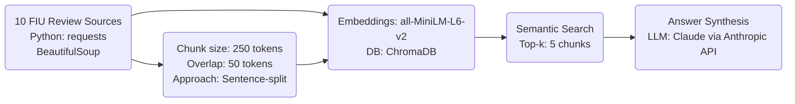

## Project 1 Planning: The Unofficial FIU Course Review Guide 

---

## Domain

This RAG system makes student generated casual information about FIU courses searchable and answerable.
While official details regarding FIU courses and curriculum are readily available online, student-driven reviews on workload, difficulty, exam format and content quality remain difficult to access. This project aims to bridge that gap, providing students with the insights needed to make informed decisions about course selection, majors, and career paths.

---

## Documents

| # | Source | Description | URL or location |
|---|--------|-------------|-----------------|
| 1 | Rate My Professors - FIU | Student reviews and ratings for FIU professors and courses | https://www.ratemyprofessors.com/campusRatings.jsp?sid=1322 |
| 2 | Reddit - r/FIU | FIU student subreddit with discussions on courses, professors, and academic life | https://www.reddit.com/r/FIU/ |
| 3 | Niche - FIU | Student reviews on academics, professors, and campus life at FIU | https://www.niche.com/colleges/florida-international-university/reviews/ |  
| 4 | Coursicle - FIU | Course and professor information with student reviews and grade distributions | https://www.coursicle.com/fiu/ |
| 5 | Facebook - FIU Book Trade & Advice | FIU student group for textbook exchange and course advice | https://www.facebook.com/groups/FIUBoardofTrade/ |
| 6 | PantherNOW - Opinion | Student newspaper opinion pieces on courses and academic experiences | https://panthernow.com/category/opinion/ |
| 7 | Uloop - FIU Professor Reviews | Student reviews and ratings for FIU professors | https://fiu.uloop.com/professors/ |
| 8 | Koofers - FIU | Professor ratings, course reviews, and study materials for FIU | https://www.koofers.com/florida-international-university-fiu/ |
| 9 | StudentsReview – FIU | Alumni and student reviews of FIU programs and specific courses | http://www.studentsreview.com/professors/FL/Florida_International_University/ |
| 10 | Professors.directory – FIU | Aggregated course-level reviews and ratings for FIU | https://www.professors.directory/school/fl-florida_international_university/ |

---

## Chunking Strategy

| Parameter | Planned Value | Rationale |
|-----------|--------------|-----------|
The documents in this project are primarily short student reviews (1-5 sentences each) with some longer, multi-paragraph reviews mixed in. To keep each review intact while also providing sufficient context, a chunk size of around 200-300 tokens is appropriate. 

Specific chunking approach:
- Chunk size: 250 tokens 
- Overlap: 50 tokens
- Splitting on sentence boundaries to avoid fragmenting reviews

Rationale: 
- 250 tokens is large enough to fully contain the majority of reviews, ensuring key information is not split across chunks
- 50 token overlap provides context from adjacent reviews without significant duplication
- Sentence-boundary splitting keeps individual opinions cohesive

If chunks were too small (e.g. 50 tokens), many reviews would be fragmented, making it difficult to retrieve full opinions. If chunks were too large (e.g. 1000 tokens), there would be too much irrelevant information per chunk, diluting search results.

Preprocessing will include removing any HTML tags, navigation elements, or repetitive header/footer text before chunking the plain review text.

**Final chunk count:** 54 chunks across 3 documents
(panthernow.txt: 26, professorsdirectory.txt: 6, reddit_fiu.txt: 22)

---

## Retrieval Approach

**Embedding model**: all-MiniLM-L6-v2 via sentence-transformers 
- Provides strong semantic search capabilities
- Fast inference speed and fully open-source for easy local use

**Top-k**: Retrieve the top 5 most relevant chunks per query
- Provides a balance of sufficient context without overwhelming the LLM
- Retrieving too few chunks (e.g. top 1-2) risks missing key information
- Retrieving too many (e.g. top 10+) increases the chance of irrelevant information 

**Production considerations for embedding model choice:**
- Multilingual support: A model like paraphrase-multilingual-MiniLM may be valuable for FIU's diverse student body
- Inference speed: While all-MiniLM-L6-v2 is fast, larger models may add latency in a production environment
- Domain-specific accuracy: Testing the model's performance on course-related jargon and slang is important
- Long-context search: Models that support longer input sequences could help with multi-paragraph reviews

---

## Evaluation Plan

| # | Question | Expected answer |
|---|----------|-----------------|
| 1 | Is COP 4710 (Database Management) a difficult course? | Reviews consistently mention high workload, challenging projects, requires significant time commitment  |
| 2 | What do students say about the exams in CHM 1045 (General Chemistry I)? | Exams are very difficult, cover a lot of material, require deep understanding beyond just memorizing  |
| 3 | What do students say about online courses at FIU? | Students mention flexibility, convenience, saves commute time but online fees are higher than in-person |
| 4 | What are the hardest CS courses at FIU according to students? | Programming 3, Operating Systems, and Data Structures are consistently mentioned as the hardest |
| 5 | How much programming experience is needed before taking COP 3530 (Data Structures)? | Most advise taking Intro to Programming (COP 2210) and OOP (COP 3337) first to be well-prepared |

---

## Anticipated Challenges

1. Inconsistent course naming across reviews (e.g. "Intro to Databases", "COP 4710", "Databases") could lead to relevant information being missed if not carefully normalized during ingestion and chunking. Mitigation: Implement synonym mapping and normalize course codes.

2. Unhelpful, off-topic, or poorly written reviews may be surfaced due to limitations in semantic search understanding. A chunk may contain a few relevant keywords without being broadly useful. Mitigation: Experiment with different top-k values and semantic search thresholds to optimize relevance.

3. Key information for a single course may be spread across multiple chunks from different reviews, making it harder to synthesize a comprehensive answer. Mitigation: Tune chunk size and overlap to strike a balance between cohesion and context, and ensure the LLM prompt encourages synthesizing information across sources.

4. Sarcasm, idioms, and contradictory opinions in the review text may be misinterpreted by the model. Mitigation: Provide clear instructions in the LLM prompt to identify and handle conflicting information and non-literal language.

---

## Architecture

---

## AI Tool Plan

**Document Ingestion**
- Tool: Claude via chat interface 
- Input: The "Documents" and "Chunking Strategy" sections of `planning.md`, plus pseudocode for the desired output format
- Expected Output: Python script to scrape text from the specified sources, clean it (remove HTML, headers, footers), and save it in a format ready for chunking
- Verification: Manually review a sample of scraped documents to ensure completeness and cleanliness

**Chunking**
- Tool: Claude via chat interface
- Input: The "Chunking Strategy" section of `planning.md`, specifically the chunk size, overlap, and splitting approach. Plus the ingested document file paths and sample content.
- Expected Output: Python script to load documents, split text into chunks of the specified size with overlap, and save chunks with metadata (source, position)  
- Verification: Manually review a sample of chunked documents, checking for proper split points and metadata

**Embedding & Vector DB**
- Tool: Claude via chat interface
- Input: The "Retrieval Approach" section of `planning.md`, specifically the embedding model (all-MiniLM-L6-v2) and vector database (ChromaDB). Plus sample chunks for indexing.
- Expected Output: Python script to load chunks, generate embeddings using the specified model, and insert embeddings into the vector database with chunk metadata
- Verification: Manually perform test queries on the populated database to verify expected similarity results

**Retrieval & Generation**
- Tool: Claude via Anthropic API
- Input: Test queries (from the "Evaluation Plan"), vector database connection details, system prompt with instructions to synthesize an answer from the retrieved chunks and cite sources
- Expected Output: Relevant chunks retrieved via semantic search, then a generated natural language answer synthesizing information from those chunks
- Verification: Manually evaluate answers against the expected result for each test query, checking for relevance, accuracy, and proper citation of sources

