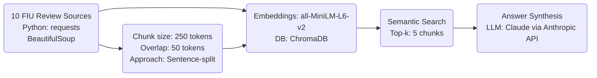

## Project 1 Planning: The Unofficial FIU Course Review Guide 

---

## Domain

This RAG system makes FIU student-generated course review knowledge searchable. The domain covers student experiences with specific FIU courses including workload, difficulty, exam format, content quality, and whether a course is worth taking sourced from platforms like Rate My Professors, Reddit, Niche, and Coursicle. This knowledge is hard to find otherwise because official FIU course catalogs describe what a course covers, not what it's actually like to take it. This project aims to bridge that gap, providing students with the insights needed to make informed decisions about course selection, majors, and career paths.

---

## Documents

| # | Source | Description | URL or location |
|---|--------|-------------|-----------------|
| 1 | Rate My Professors - FIU | Student reviews and ratings for FIU professors and courses | https://www.ratemyprofessors.com/campusRatings.jsp?sid=1322 |
| 2 | Reddit - r/FIU | FIU student subreddit with discussions on courses, professors, and academic life | https://www.reddit.com/r/FIU/ |
| 3 | Niche - FIU | Student reviews on academics, professors, and campus life at FIU | https://www.niche.com/colleges/florida-international-university/reviews/ |  
| 4 | Coursicle - FIU | Course and professor information with student reviews and grade distributions | https://www.coursicle.com/fiu/ |
| 5 | Facebook - FIU Book Trade & Advice | FIU student group for textbook exchange and course advice | https://www.facebook.com/groups/FIUBoardofTrade/ |
| 6 | PantherNOW - Opinion | Student newspaper opinion pieces on courses and academic experiences | https://panthernow.com/category/opinion/ |
| 7 | Uloop - FIU Professor Reviews | Student reviews and ratings for FIU professors | https://fiu.uloop.com/professors/ |
| 8 | Koofers - FIU | Professor ratings, course reviews, and study materials for FIU | https://www.koofers.com/florida-international-university-fiu/ |
| 9 | StudentsReview – FIU | Alumni and student reviews of FIU programs and specific courses | http://www.studentsreview.com/professors/FL/Florida_International_University/ |
| 10 | Professors.directory – FIU | Aggregated course-level reviews and ratings for FIU | https://www.professors.directory/school/fl-florida_international_university/ |

---

## Chunking Strategy

| Parameter | Planned Value | Rationale |
|-----------|--------------|-----------|
| Chunk size | ~250 tokens | Matches average review length; keeps one review per chunk |
| Overlap | ~50 tokens | Preserves context at boundaries without duplication |
| Strategy | Sentence-aware splitting | Avoids cutting mid-review or mid-sentence |

---

## Retrieval Approach

**Embedding model:** all-MiniLM-L6-v2 via sentence-transformers
- Runs locally without API key, strong semantic similarity performance on short text

**Top-k:** Retrieve top 5 most relevant chunks per query 
- Balances having enough context without overwhelming generation step

**Production tradeoff reflection:**
- OpenAI's text-embedding-ada-002 would provide higher quality at low cost
- Multilingual models like paraphrase-multilingual-MiniLM would better serve FIU's diverse student body
- Longer context models could handle multi-paragraph reviews without splitting
- Accuracy on academic/course-specific jargon is important to validate

---

## Evaluation Plan

| # | Question | Expected answer |
|---|----------|-----------------|
| 1 | Is COP 4710 (Database Management) a difficult course? | Reviews consistently mention high workload, challenging projects, requires significant time commitment  |
| 2 | What do students say about the exams in CHM 1045 (General Chemistry I)? | Exams are very difficult, cover a lot of material, require deep understanding beyond just memorizing  |
| 3 | Is ENC 1101 (Writing and Rhetoric I) a useful course for developing college writing skills? | Reviews often mention improved essay writing, research skills, and confidence in academic writing after taking ENC 1101 | 
| 4 | What are the most useful upper-division electives for CS majors? | Reviews often recommend AI, ML, NLP and data science electives as useful for job market |
| 5 | How much programming experience is needed before taking COP 3530 (Data Structures)? | Most advise taking Intro to Programming (COP 2210) and OOP (COP 3337) first to be well-prepared |

---

## Anticipated Challenges

1. Inconsistent acronyms and course codes across sources (e.g. "Intro to Databases" vs "COP4710") could lead to missed connections in retrieval. 
Mitigation: Normalize course codes and titles during ingestion.

2. Unhelpful or off-topic review text could be surfaced if semantic similarity is misled by a few key words.   
Mitigation: Set a similarity threshold for retrieval and validate top-k before passing to generation.

---

## Architecture

---

## AI Tool Plan

**Document Ingestion**
- Tool: Claude (via chat interface) 
- Input: 10 source URLs + description of desired output format
- Expected Output: Python script to scrape, clean, and save review text from each URL
- Verification: Manually inspect a sample of scraped reviews for formatting and metadata

**Chunking**
- Tool: Claude (via chat interface)
- Input: Ingested review text files, specified chunk size + overlap parameters  
- Expected Output: Python script to split review text into consistently-sized chunks
- Verification: Print a sample of chunks, check for proper splitting and metadata

